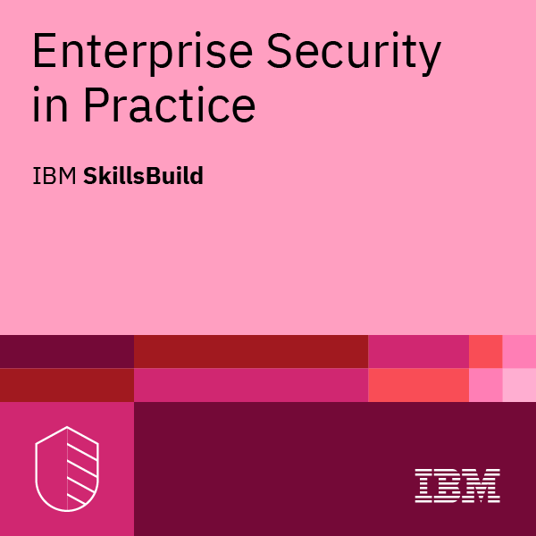
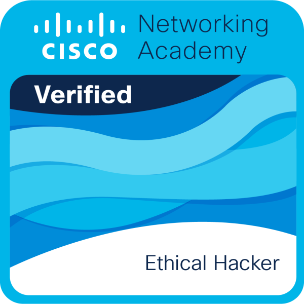
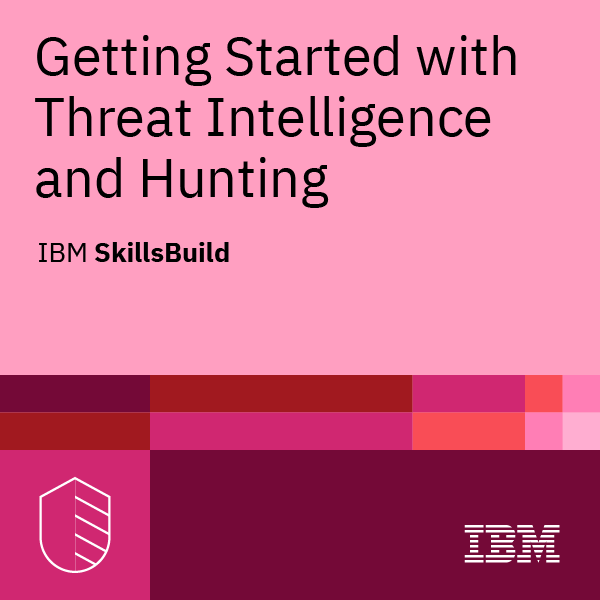
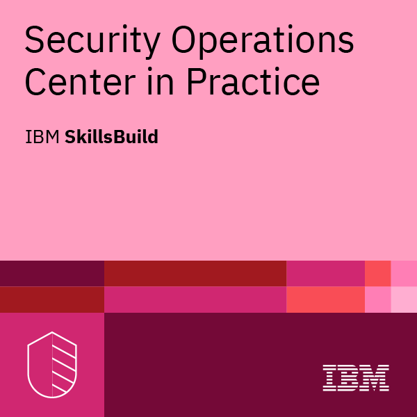

# 👋 Selam, ben Yağız (galile0ff)
### Makine Mühendisi • Geliştirici • Siber Güvenlik Uzmanı

  Sürekli öğrenen, üreten ve çalışan sistemler inşa etmeyi seven biriyim. Siber güvenlik, otomasyon ve özelleştirilmiş makine çözümleri özel ilgi alanlarım.

---

## 🚀 Yeteneklerim & Kullandığım Teknolojiler

<table width="100%">
  <tr>
    <td valign="top" width="50%">
      

        <h4>💻 Programlama & Diller</h4>
        

          
          
          
          
          
          
        

      

    </td>
    <td valign="top" width="50%">
      

        <h4>🌐 Web & Backend</h4>
        

          
          
          
          
          
          
        

      

    </td>
  </tr>
  <tr>
    <td valign="top" width="50%">
      

        <h4>🗄️ Veritabanı & Cache</h4>
        

          
          
          
          
        

      

    </td>
    <td valign="top" width="50%">
      

        <h4>⚙️ DevOps & Sistem</h4>
        

          
          
          
          
          
          
        

      

    </td>
  </tr>
</table>

---

## 🎓 Rozetlerim

  
  
  
  
  
  

  <a href="https://www.credly.com/users/galileoff/badges">Tüm rozetlerimi Credly'de görüntüleyin</a>

---

## 📊 GitHub İstatistiklerim

  
  
  

  

  

---

## 📫 Bana Ulaşın

  
  
  
  
  

