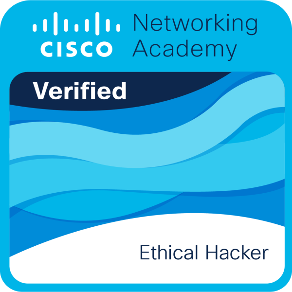
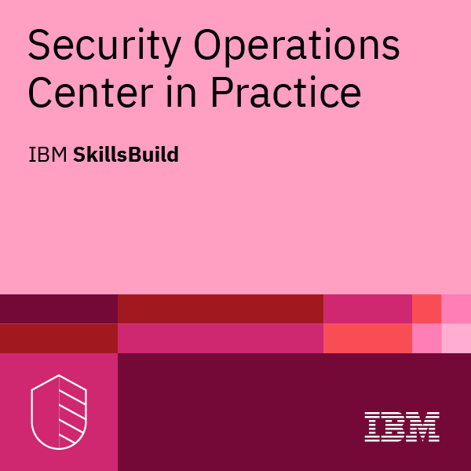
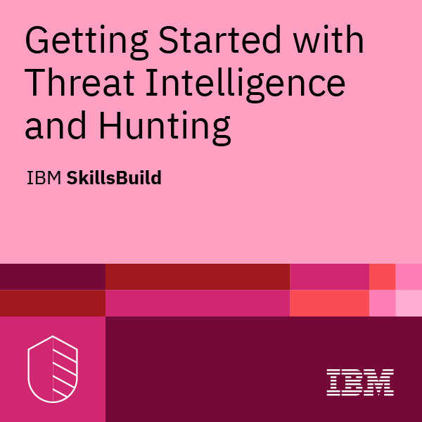
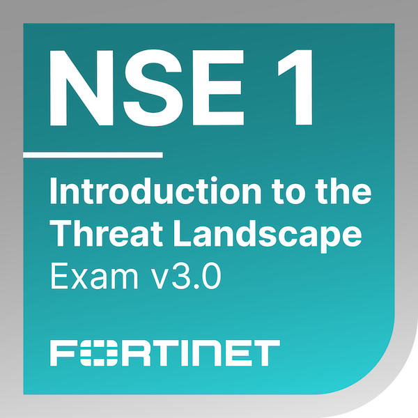
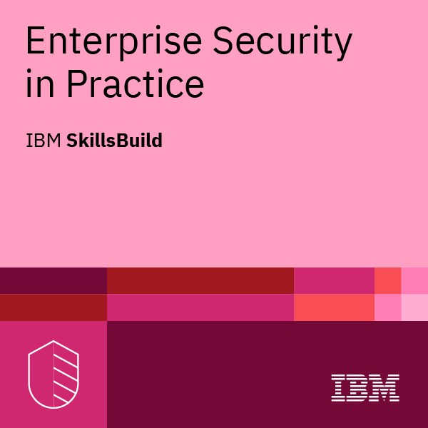
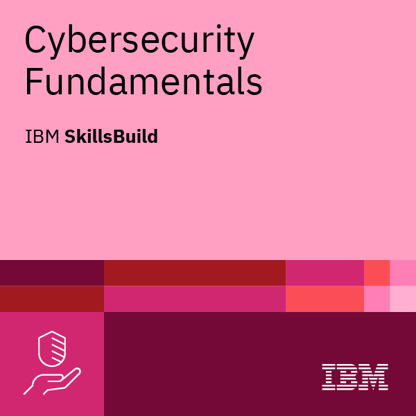
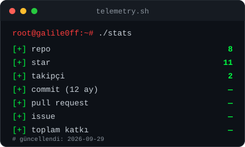
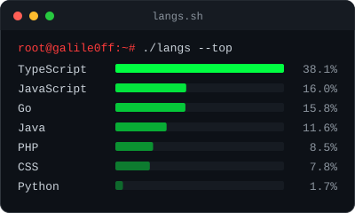

<p align="center">
  
</p>

<p align="center">
  
  
  
</p>

```console
root@galile0ff:~# cat about.txt

Donanımla yazılımın kesiştiği yerde çalışıyorum.
Mekanik bir sistemi de bir ağı da aynı şekilde okurum:
nerede varsayım yapılmış, nerede zayıf, nerede kırılır.
Kırmayı öğrendiğim şeyi, daha sağlam kurmak için kullanırım.
```

---

### `~/focus`

```text
.
├── offensive/     pentest, zafiyet analizi, ethical hacking
├── blue-team/     SOC operasyonları, threat intelligence, threat hunting
├── automation/    tekrar eden işi script'e, script'i araca çevirmek
├── backend/       güvenli API tasarımı, kimlik doğrulama, servisler
└── machines/      mekanik tasarım ve özel makine çözümleri
```

---

### `~/methodology`

<p align="center">
  
</p>

---

### `~/arsenal`

**diller**<br>


**web & backend**<br>


**veri**<br>


**altyapı & sistem**<br>


**güvenlik**<br>


---

### `~/certs`

Cisco / Credly üzerinden doğrulanabilir. Rozete tıkla, doğrulama sayfası açılır.

<p align="center">
  <a href="https://www.credly.com/badges/fd4e6bfe-bcd9-4a27-8105-21d03702f4a5"></a>
  <a href="https://www.credly.com/badges/e98d3e8e-28ae-4e22-8ea0-f7659db3aaf6"></a>
  <a href="https://www.credly.com/badges/d5c3f074-8701-4827-a163-89381fa112e2"></a>
  <a href="https://www.credly.com/badges/970c3ca0-25ed-45e6-b710-454617fd1cf6"></a>
  <a href="https://www.credly.com/badges/d8fd3eb1-453d-4208-bb30-be5ec0be02f6"></a>
  <a href="https://www.credly.com/badges/9ed642b5-b22c-487a-b599-880228c6b515"></a>
</p>

<p align="center"><a href="https://www.credly.com/users/galileoff/badges"><code>tüm rozetler → credly.com/users/galileoff</code></a></p>

---

### `~/telemetry`

<p align="center">
  
  
</p>

---

### `~/contact`

```console
root@galile0ff:~# ./reach --all --status

[+] E-Mail     :: yaizm058@gmail.com          [ONLINE]
[+] LinkedIn   :: in/m-enes-yağız             [ESTABLISHED]
[+] Telegram   :: @galileoff                  [ACTIVE]
[+] Instagram  :: @enesyagiz_f                [IDLE]
[+] Support    :: buymeacoffee.com/galileoff   [OPEN]
```

<p align="center">
  <a href="mailto:yaizm058@gmail.com"></a>
  <a href="https://www.linkedin.com/in/m-enes-ya%C4%9F%C4%B1z/"></a>
  <a href="https://t.me/galileoff"></a>
  <a href="https://www.instagram.com/enesyagiz_f/"></a>
  <a href="https://buymeacoffee.com/galileoff"></a>
</p>

---

<h3 align="center"><sub><code>eğitim, araştırma ve yetkili testler için. izin almadığın sistemde tek paket bile gönderme.</code></sub></h3>
